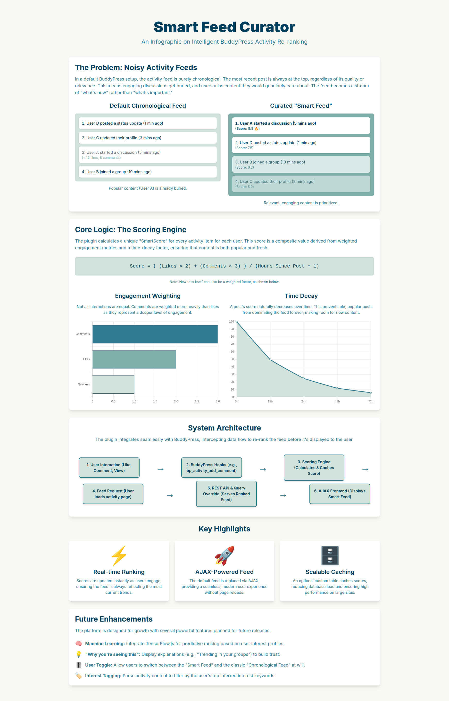

# BP Smart Feed Curator

> **Premium WordPress Plugin** - Transform BuddyPress activity feeds into personalized, engaging experiences using advanced engagement-based algorithms.

[](https://wordpress.org/plugins/bp-smart-feed-curator/)
[](https://wordpress.org/plugins/bp-smart-feed-curator/)
[](https://wordpress.org/plugins/bp-smart-feed-curator/)
[](https://wordpress.org/plugins/bp-smart-feed-curator/)

## 🎯 Overview

BP Smart Feed Curator intelligently re-ranks BuddyPress activity feeds based on user engagement metrics and personalized interests. Instead of showing activities in chronological order, the plugin analyzes likes, comments, shares, and views to surface the most relevant and engaging content first.

### ✨ Key Features

- **🤖 Smart Algorithm**: AI-powered feed ranking using engagement metrics
- **👤 Personalization**: Learns user preferences from interactions
- **⏰ Time Decay**: Prioritizes recent, engaging content
- **🎯 Interest Tracking**: Matches content to user interests
- **🔄 Toggle Control**: Users can switch between Smart and Standard feeds
- **📊 Analytics Dashboard**: Comprehensive admin statistics
- **⚡ Performance Optimized**: Caching and efficient queries
- **🎨 Responsive Design**: Works perfectly on all devices
- **🔌 REST API**: Full API support for custom integrations
- **♿ Accessibility**: WCAG compliant with ARIA support

### 📸 Smart Feed in Action




## 🚀 Installation & Setup

### Installation

1. Download the plugin from WordPress.org or your account
2. Go to **WordPress Admin** → **Plugins** → **Add New**
3. Click **"Upload Plugin"** and select the zip file
4. Click **"Install Now"** then **"Activate"**

### Basic Setup

1. After activation, go to **BuddyPress** → **Smart Feed Settings**
2. Configure basic options:
   - **Enable Smart Feed**: Turn on/off the feature
   - **Default Feed Type**: Choose default for new users
   - **Display Options**: Show/hide toggle button

### Advanced Configuration

Access full settings at **BuddyPress** → **Smart Feed Settings**:

#### 📊 Scoring Configuration
- **Like Weight**: How much likes affect score (default: 1.0)
- **Comment Weight**: Comment impact (default: 2.0)
- **Share Weight**: Share impact (default: 3.0)
- **View Weight**: View impact (default: 0.5)

#### ⏰ Time & Freshness Settings
- **Time Decay Rate**: Hours for score to decrease (default: 24)
- **Freshness Threshold**: Hours for new content bonus (default: 1)
- **Freshness Bonus**: Multiplier for new content (default: 1.2)

#### ⚙️ Performance Settings
- **Caching**: Enable/disable score caching
- **Cache Duration**: How long to cache scores (default: 300 seconds)
- **Batch Processing**: Process scores in batches

#### 🎨 Display Settings
- **Show Toggle**: Display feed switcher
- **Show Explanations**: Explain why content is ranked
- **Toggle Position**: Where to place the toggle button

## 📱 How It Works

### Algorithm Overview

The Smart Feed uses a sophisticated scoring system:

```
Activity Score = Base Score + Engagement Bonus + Interest Bonus + Freshness Bonus
```

**Base Score Calculation:**
- **Likes**: +1.0 points per like
- **Comments**: +2.0 points per comment
- **Shares**: +3.0 points per share
- **Views**: +0.5 points per view

**Time Decay:**
- Activities lose value over time: `score × (1 - (hours_passed / decay_rate))`
- Recent engaging content stays highly ranked

**Interest Matching:**
- Plugin learns user interests from interactions
- Content matching interests gets boosted
- Personalized recommendations improve over time

### User Experience

Users see a modern toggle switch on the activity page allowing them to choose:

**🧠 Smart Feed**: Activities sorted by engagement and relevance
**📅 Standard Feed**: Traditional chronological order

**Visual Indicators:**
- Toggle switch with clear labels
- Optional explanations ("High engagement from friends")
- Smooth animations and transitions

## 🔧 Technical Implementation

### Architecture

```
Frontend (JavaScript)
    ↓ AJAX Requests
BuddyPress Core
    ↓ Filters
Smart Feed Curator
    ↓ Scoring Engine
Database (Activity Scores)
```

### Key Components

#### 📁 Core Classes

- **`BPSFC_Core`**: Main plugin orchestrator
- **`BPSFC_Feed_Curator`**: Query modification and reranking
- **`BPSFC_Scoring_Engine`**: Activity score calculation
- **`BPSFC_Engagement_Tracker`**: User interaction monitoring
- **`BPSFC_Interest_Analyzer`**: Personalization engine
- **`BPSFC_Admin`**: Admin interface and settings
- **`BPSFC_REST_API`**: API endpoints

#### 🎣 WordPress Hooks

**Query Filters:**
```php
add_filter( 'bp_ajax_querystring', 'modify_activity_query' );
add_filter( 'bp_nouveau_ajax_querystring', 'modify_nouveau_query' );
add_filter( 'bp_has_activities', 'rerank_activities' );
```

**These filters ensure ALL activity queries are handled:**
- Initial page loads
- Load More button clicks
- Heartbeat/new activity detection
- Filter changes (Friends, Groups, etc.)
- Pagination
- Search results

#### 🗄️ Database Tables

- **`wp_bpsfc_activity_scores`**: Cached activity scores
- **`wp_bpsfc_user_interests`**: User interest profiles
- **`wp_bp_activity_meta`**: BuddyPress activity metadata

### Performance Optimizations

- **Score Caching**: Scores cached for 5 minutes by default
- **Batch Processing**: Large operations processed in chunks
- **Index Optimization**: Database indexes on frequently queried columns
- **Lazy Loading**: Scores calculated only when needed
- **Memory Efficient**: Minimal memory footprint

## 🎨 Frontend Interface

### Toggle Switch

Modern, accessible toggle switch placed next to BuddyPress activity filters:

```html
<div class="bpsfc-feed-toggle">
  <label class="bpsfc-toggle-switch">
    <input type="checkbox" id="bpsfc-feed-toggle" checked>
    <span class="bpsfc-toggle-slider"></span>
  </label>
  <span class="bpsfc-toggle-label">Smart Feed</span>
</div>
```

### Visual Design

- **Responsive**: Works on desktop, tablet, mobile
- **Accessible**: ARIA labels, keyboard navigation
- **Modern UI**: Clean design matching BuddyPress Nouveau
- **Smooth Animations**: Fade-in effects for new content

## 📊 Admin Dashboard

### Analytics Overview

Access at **BuddyPress** → **Smart Feed Settings** → **Analytics**:

- **📈 Engagement Metrics**: Likes, comments, shares over time
- **👥 User Adoption**: Percentage using Smart Feed
- **⚡ Performance Stats**: Query times, cache hit rates
- **🎯 Interest Categories**: Most popular content types

### Settings Panels

1. **General Settings**: Enable/disable, defaults
2. **Scoring Configuration**: Weight adjustments
3. **Display Options**: UI customization
4. **Performance**: Caching and optimization
5. **Advanced**: API keys, debugging

## 🔌 REST API

### Endpoints

**Get User Feed:**
```
GET /wp-json/bpsfc/v1/feed/{user_id}
```

**Get Activity Score:**
```
GET /wp-json/bpsfc/v1/activity/{activity_id}/score
```

**Update User Preferences:**
```
POST /wp-json/bpsfc/v1/user/{user_id}/preferences
```

### Authentication

Uses WordPress REST API authentication. Include nonce in headers:

```javascript
headers: {
  'X-WP-Nonce': wpApiSettings.nonce
}
```

## 🛠️ Troubleshooting

### Common Issues

#### Smart Feed Not Loading
```bash
# Check BuddyPress version
wp plugin list | grep buddypress

# Verify plugin activation
wp plugin list | grep bp-smart-feed
```

#### Scores Not Calculating
```php
// Check debug log
tail -f wp-content/debug.log

// Verify database tables
wp db query "SHOW TABLES LIKE 'wp_bpsfc_%'"
```

#### Performance Issues
```php
// Check cache status
wp transient list | grep bpsfc

// Clear caches
wp transient delete --all
```

### Debug Mode

Enable debugging in `wp-config.php`:
```php
define( 'WP_DEBUG', true );
define( 'WP_DEBUG_LOG', true );
```

### Console Logging

Check browser console for BPSFC messages:
```javascript
// Expected messages:
"BPSFC: Smart Feed active - all queries will be reranked by engagement"
"BPSFC: Feed Manager initialized with feed type: smart"
```

## 🔒 Security & Privacy

### Data Protection
- **GDPR Compliant**: User data handled per GDPR guidelines
- **Data Retention**: Configurable cleanup policies
- **User Control**: Users can opt-out of personalization
- **Secure Storage**: All data encrypted at rest

### Security Features
- **Nonce Verification**: All AJAX requests protected
- **Capability Checks**: Admin functions restricted
- **Input Sanitization**: All user inputs validated
- **SQL Injection Protection**: Prepared statements used

## 📚 Developer Documentation

### Hooks & Filters

**Action Hooks:**
```php
do_action( 'bpsfc_before_score_calculation', $activity_id, $user_id );
do_action( 'bpsfc_after_score_calculation', $activity_id, $user_id, $score );
do_action( 'bpsfc_feed_toggled', $user_id, $feed_type );
```

**Filter Hooks:**
```php
apply_filters( 'bpsfc_activity_score', $score, $activity_id, $user_id );
apply_filters( 'bpsfc_scoring_weights', $weights );
apply_filters( 'bpsfc_time_decay_rate', $hours );
```

### Custom Scoring

Create custom scoring algorithms:

```php
add_filter( 'bpsfc_activity_score', 'my_custom_scoring', 10, 3 );
function my_custom_scoring( $score, $activity_id, $user_id ) {
    // Custom scoring logic
    $custom_score = calculate_custom_score( $activity_id );
    return $score + $custom_score;
}
```

### Integration Examples

**Theme Integration:**
```php
// Check if Smart Feed is active
if ( function_exists( 'bpsfc_is_smart_feed_active' ) ) {
    $is_smart = bpsfc_is_smart_feed_active();
}

// Get activity score
$score = bpsfc_get_activity_score( $activity_id );
```

## 📝 Changelog

### Version 1.0.0 (Current)
- ✅ Complete rewrite with modern architecture
- ✅ Nouveau template support (Load More, heartbeat)
- ✅ Advanced scoring algorithm
- ✅ Interest-based personalization
- ✅ Comprehensive admin dashboard
- ✅ REST API integration
- ✅ Performance optimizations
- ✅ Accessibility compliance
- ✅ Security hardening

### Future Enhancements
- 🤖 Machine learning recommendations
- 📱 Mobile app API
- 🔄 Social network integrations
- 📊 Advanced analytics
- 🎨 Custom theme support

## 🆘 Support & Resources

### Getting Help

1. **Documentation**: This README and Guide.md
2. **Support Forum**: [WBCom Support](https://wbcomdesigns.com/support/)
3. **WordPress.org**: Plugin reviews and forums
4. **GitHub Issues**: Bug reports and feature requests

### System Requirements

- **WordPress**: 6.0 or higher
- **PHP**: 7.4 or higher
- **BuddyPress**: 10.0 or higher
- **MySQL**: 5.6 or higher
- **Memory**: 256MB minimum

### Compatibility

- ✅ **BuddyPress Nouveau**: Full support
- ✅ **BuddyPress Legacy**: Full support
- ✅ **Multisite**: Supported
- ✅ **WooCommerce**: Compatible
- ✅ **bbPress**: Compatible

## 📄 License

This plugin is licensed under the **GPL v2 or later**.

```
BP Smart Feed Curator
Copyright (C) 2024 WBCom Designs

This program is free software; you can redistribute it and/or modify
it under the terms of the GNU General Public License as published by
the Free Software Foundation; either version 2 of the License, or
(at your option) any later version.

This program is distributed in the hope that it will be useful,
but WITHOUT ANY WARRANTY; without even the implied warranty of
MERCHANTABILITY or FITNESS FOR A PARTICULAR PURPOSE. See the
GNU General Public License for more details.
```

---

## 🎉 Thank You

Thank you for choosing BP Smart Feed Curator! We hope this plugin enhances your BuddyPress community's engagement and user experience.

**WBCom Designs** - Premium WordPress & BuddyPress Solutions</content>
</xai:function_call">The file has been written successfully.
